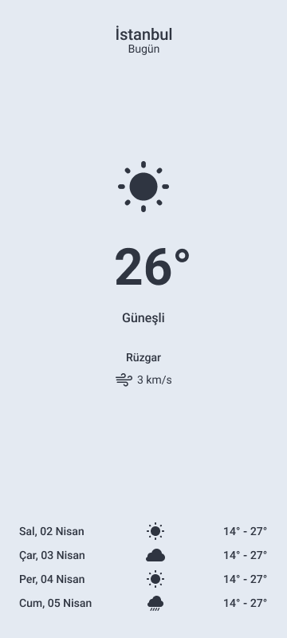
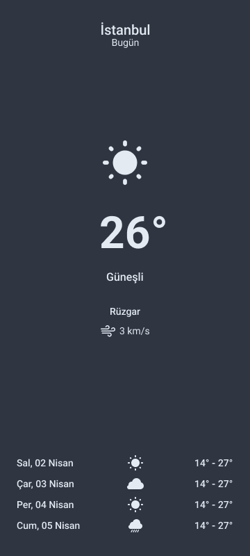

Merhaba,

Roadmap'i tamamladıktan sonra ilk görevine başlıyorsun.

Önce konular hakkındaki kaynaklara göz atmanda fayda var. Sonrasında başlamak için hazır olacaksın.

Başarılar!

## Konu 
ConstraintLayout ile UI tasarlama

## Hedef 
Aşağıdaki UI tasarımları verilen ekranları ConstraintLayout ve ilgili View'ları kullanarak tasarlamak. Şimdilik Light ya da Dark mode tasarımlardan istediğini seçebilirsin.

## Kaynaklar 
- [Build a Responsive UI with ConstraintLayout](https://developer.android.com/develop/ui/views/layout/constraint-layout)
- [Use ConstraintLayout to design your Android views](https://developer.android.com/codelabs/constraint-layout#0)

## İdeal Süre
todo

## UI Tasarım

| Light Mode             | Dark Mode                                                                |
| ----------------- | ------------------------------------------------------------------ |
|   |  |

### UI Specs 

Tasarlarken dikkat edeceğin ölçüleri buradan alabilirsin. Ayrıca tasarımdaki icon'ları [/icons](./icons) altında bulabilirsin.

